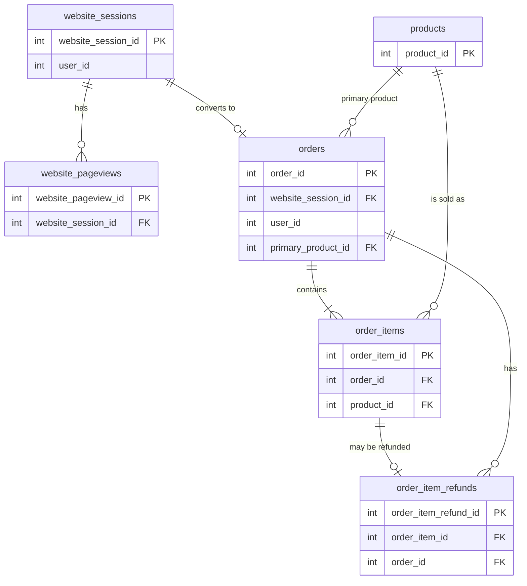

# 🧸 Toy Store E-Commerce Database Analysis

> SQL analysis of an online toy store's website traffic, orders, products and refunds using **PostgreSQL**.


---

## 📌 Table of Contents
1. [Project Overview](#-project-overview)
2. [Business Problem](#-business-problem)
3. [Dataset](#-dataset)
4. [Database Schema & Relationships](#-database-schema--relationships)
5. [Tools & Skills Used](#-tools--skills-used)
6. [Project Workflow](#-project-workflow)
7. [Business Questions Answered](#-business-questions-answered)
8. [Key Insights](#-key-insights)
9. [Recommendations](#-recommendations)
10. [Repository Structure](#-repository-structure)
11. [How to Run This Project](#️-how-to-run-this-project)
12. [Author](#-author)

---

## 📖 Project Overview

This project analyzes the data of an online **toy store** to understand how visitors move through the website, how many of them become customers, which products sell best, and how refunds affect revenue.

The database contains **6 related tables** covering the full customer journey: **website session → page views → order → order items → refunds**.

**Objective:** Use SQL to turn raw e-commerce data into answers a business team can act on.

---

## 🎯 Business Problem

The management team wants to know:

- Which traffic sources and devices bring the most valuable visitors?
- Where do users drop off before buying?
- How are orders and revenue trending over time?
- Which products perform best, and which have high refund rates?
- How many customers come back to buy again?

*(Edit this section to match your own framing of the problem.)*

---

## 🗂 Dataset

| Detail | Information |
|---|---|
| **Name** | Toy Store E-Commerce Database (Maven Analytics – Fuzzy Factory) |
| **Source** | [Maven Analytics Data Playground](https://mavenanalytics.io/data-playground) *(update link if different)* |
| **Format** | CSV files loaded into PostgreSQL |
| **Tables** | 6 |
| **Time period** | *(add start date – end date)* |
| **Total rows** | *(add row counts, e.g. orders: XX,XXX)* |

> ⚠️ Raw CSV files are not uploaded here because of file size. Download them from the source link above.

---

## 🧩 Database Schema & Relationships

### Tables

| Table | Description | Primary Key | Foreign Key(s) |
|---|---|---|---|
| `website_sessions` | One row per website visit (traffic source, device, repeat visit) | `website_session_id` | `user_id` |
| `website_pageviews` | Every page viewed within a session | `website_pageview_id` | `website_session_id` |
| `orders` | One row per customer order | `order_id` | `website_session_id`, `user_id`, `primary_product_id` |
| `order_items` | Individual products inside each order | `order_item_id` | `order_id`, `product_id` |
| `order_item_refunds` | Refunds issued against order items | `order_item_refund_id` | `order_item_id`, `order_id` |
| `products` | Product catalog | `product_id` | – |

> 📝 Check this against your own files and edit if needed.

### Entity Relationship Diagram



*(You can replace this with a screenshot of the ERD from pgAdmin/DBeaver: save it in `/images` and use ``.)*

### Relationship Summary

- One **session** can have many **page views**.
- One **session** can lead to at most one **order**.
- One **order** can have many **order items**.
- One **product** can appear in many **order items**.
- One **order item** can have at most one **refund**.

---

## 🛠 Tools & Skills Used

**Tools**
- PostgreSQL
- pgAdmin / DBeaver
- GitHub

**SQL Skills Demonstrated**
- Database and table creation (`CREATE TABLE`, primary and foreign keys)
- Data loading (`COPY` / Import)
- Data cleaning and validation (nulls, duplicates, date checks)
- Multi-table `JOIN`s (INNER, LEFT)
- Aggregations (`GROUP BY`, `HAVING`)
- Common Table Expressions (CTEs)
- Subqueries
- Window functions (`ROW_NUMBER`, `RANK`, `LAG`, running totals)
- `CASE WHEN` for segmentation
- Date functions for monthly and weekly trends

*(Remove anything you did not use.)*

---

## 🔄 Project Workflow

1. **Understand the data**: read the data dictionary and identify keys between tables.
2. **Create the database and tables** with correct data types and keys.
3. **Load the CSV files** into PostgreSQL.
4. **Profile and clean the data**: row counts, nulls, duplicates, date ranges.
5. **Define business questions** before writing queries.
6. **Write SQL queries** to answer each question.
7. **Summarize insights and recommendations.**

---

## ❓ Business Questions Answered

### 1. Traffic & Conversion
- [ ] What is the session-to-order conversion rate overall and by traffic source?
- [ ] Which device type converts better?
- [ ] How many sessions come from repeat visitors?

### 2. Website Funnel
- [ ] Which pages do users visit most?
- [ ] At which step do most users drop off?

### 3. Orders & Revenue
- [ ] What are the monthly orders and revenue trends?
- [ ] What is the average order value (AOV)?
- [ ] What percentage of orders contain more than one item?

### 4. Products
- [ ] Which products generate the most revenue and profit?
- [ ] What is the refund rate for each product?

### 5. Customers
- [ ] How many customers placed more than one order?
- [ ] What share of customers returned within 30 days?

*(Tick the boxes as you complete them, and add the query file name next to each.)*

---

## 📊 Key Insights

> Fill this in after running your queries. Use real numbers from your results.

1. **Insight 1:** *(e.g. "Source X drives Y% of sessions but converts at only Z%.")*
2. **Insight 2:** *(e.g. "Refund rate for Product A is X%, higher than the other products.")*
3. **Insight 3:** *(e.g. "Orders grew X% from Month A to Month B.")*
4. **Insight 4:** *(add more if needed)*

---

## 💡 Recommendations

1. *(Action based on Insight 1)*
2. *(Action based on Insight 2)*
3. *(Action based on Insight 3)*

---

## 📁 Repository Structure

```
Toy_Store_E-Commerce_Database/
│
├── 01_schema/
│   └── create_tables.sql
│
├── 02_data_loading/
│   └── load_data.sql
│
├── 03_cleaning/
│   └── data_quality_checks.sql
│
├── 04_analysis/
│   ├── traffic_and_conversion.sql
│   ├── website_funnel.sql
│   ├── orders_and_revenue.sql
│   ├── products_and_refunds.sql
│   └── customer_behavior.sql
│
├── images/
│   ├── erd.png
│   └── query_results.png
│
└── README.md
```

*(Rename the files and folders to match what you actually have.)*

---

## ▶️ How to Run This Project

1. **Install** PostgreSQL and pgAdmin (or DBeaver).
2. **Download** the dataset CSV files from the [source](#-dataset).
3. **Create a database:**
   ```sql
   CREATE DATABASE toy_store;
   ```
4. **Create the tables:** run `01_schema/create_tables.sql`.
5. **Load the data:** update the file paths in `02_data_loading/load_data.sql` and run it.
6. **Check data quality:** run `03_cleaning/data_quality_checks.sql`.
7. **Run the analysis queries** in `04_analysis/`.

---

## 🚀 Future Improvements

- Build a **Power BI dashboard** on top of this database
- Validate key metrics in **Excel**
- Add indexes and compare performance with `EXPLAIN ANALYZE`
- Create views for commonly used KPIs

---

## 👤 Author

**Gitesh Soni**
Business Analyst | Product Analyst | Data & BI Analyst

- 📧 giteshsoni2@gmail.com
- 💼 [LinkedIn](https://www.linkedin.com/in/giteshsoni)
- 🎨 [Behance](https://www.behance.net/giteshsoni)

---

⭐ If you found this project useful, feel free to star the repository.
